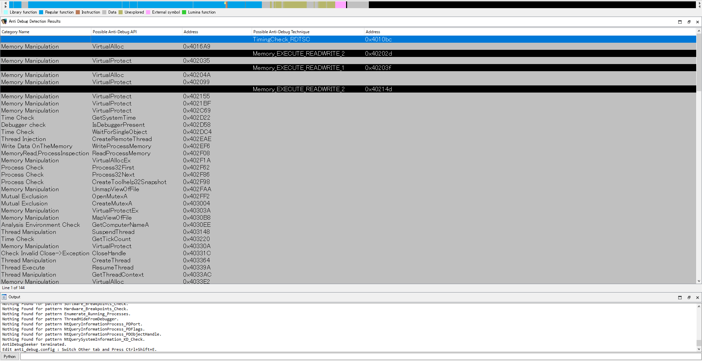
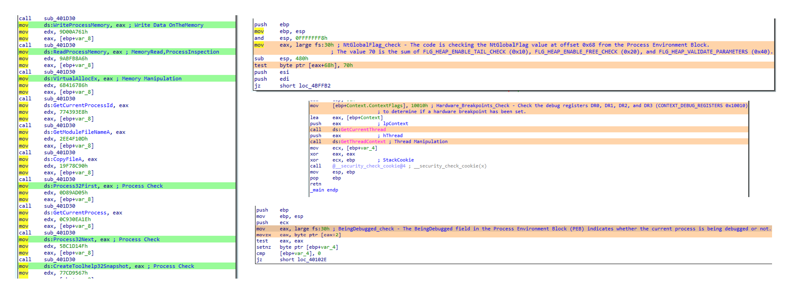
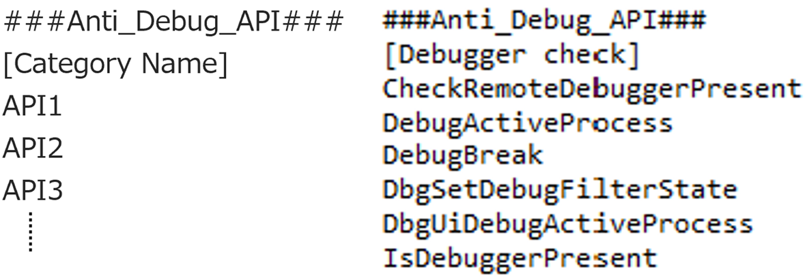
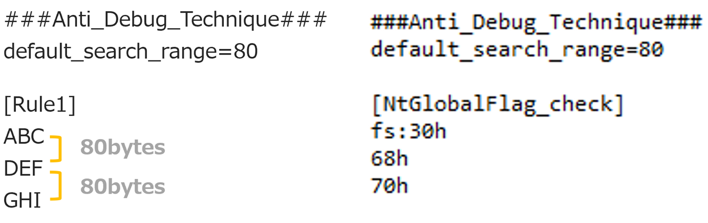
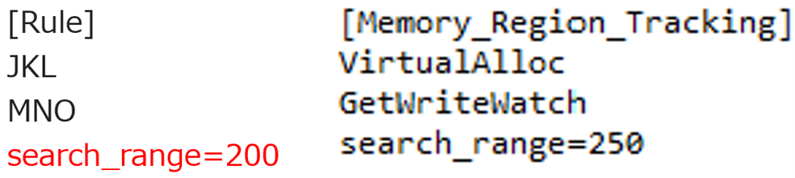

# IDA_Plugin_AntiDebugSeeker

## Concept

This tool not only enables those with experience in malware analysis to handle anti-debugging more quickly but also those who are new to malware analysis or are not yet familiar with anti-debugging techniques. 
Through this tool, users can automatically extract potential anti-debugging methods used by malware, making it easier for analysts to take appropriate action.

## Introduction

The main functionalities of this plugin are as follows:

- Extraction of Windows API that are potentially being used for anti-debugging by the malware  
  (All subsequent API represent the Windows API)  
- In addition to API, extraction of anti-debugging techniques based on key phrases that serve as triggers, as some anti-debugging methods cannot be comprehensively identified by API calls alone.

Additionally, the file that defines the detection rules is designed to easily add keywords you want to detect.  
This allows analysts to easily add new detection rules or make changes.  
  
For packed malware, running this plugin after unpacking and fixing the Import Address Table is more effective.

## Installation

Place the following three files under the plugin directory of IDA :

1. anti_debug.config (A file containing rules for detecting anti-debugging techniques)  
2. anti_debug_techniques_descriptions.json (A file containing descriptions of the detected rules)  
3. AntiDebugSeeker.py (The anti-debugging detection program)

From Ver1.1, PyQt5 installation is required.  
pip install PyQt5

## Usage

**Ctrl + Shift + D (To launch the plugin)**    
A screen named “Anti Debug Detection Results” will appear after the analysis is complete.

Anti Debug Detection Results

- Category Name:  
API category name defined in the Anti_Debug_API as listed in anti_debug.config.  

- Possible Anti-Debug API:  
List of detected APIs displayed.  

- Address:  
Address where the detected API is being used.  

- Possible Anti-Debug Technique:  
Detection name identified by the keyword defined in Anti_Debug_Technique as listed in anti_debug.config.  

- Address:  
Address of the first detected keyword.  

(Address Transition)  
By double-clicking on the detected line, you will jump to the address specified.  

**Ctrl + Shift + E (Config File Editing)**  
Functionality for checking and editing the contents of anti_debug.config.  

After making changes,  
click the 'Save' button to save the modifications.  

## Support Functions

After running the plugin, detected APIs and keywords are highlighted in different colors.  
Additionally, if an API specified in Anti_Debug_API is detected, the category name is added as a comment. Likewise, if a rule name is detected in Anti_Debug_Technique, a description of that rule is added as a comment to the first detected keyword.

## About anti_debug.config

This config file contains the detection rules that are utilized by AntiDebugSeeker.py.  
There are sections named Anti_Debug_API and Anti_Debug_Technique.  

- **Anti_Debug_API**  

you can freely create categories and add APIs that you wish to detect. **(exact match)**  

- **Anti_Debug_Technique**  

You can set between one to three keywords. **(partial match)**  

The basic flow of the search is as follows:  
First, search for the first keyword. If it is found, search within the specified number of bytes (default is 80 bytes) for the second keyword.  
The same process is then applied for searching for the third keyword.  

If you want to set a **custom search range** instead of using the default value, you can specify 'search_range=value' at the end of the keyword you've set.  
This allows you to change the search range for each rule you've configured.

## List of detectable anti-debugging techniques (Ver1.0)  

The following is a list of rule names defined in the Anti_Debug_Technique section of the antidebug.config.  

HeapTailMarker  
KernelDebuggerMarker  
DbgBreakPoint_RET  
DbgUiRemoteBreakin_Debugger_Terminate  
PMCCheck_RDPMC  
TimingCheck_RDTSC  
SkipPrefixes_INT1  
INT2D_interrupt_check  
INT3_interrupt_check  
EXCEPTION_BREAKPOINT  
ICE_interrupt_check  
DBG_PRINTEXCEPTION_C  
TrapFlag_SingleStepException  
BeingDebugged_check  
NtGlobalFlag_check  
NtGlobalFlag_check_2  
HeapFlags  
HeapForceFlags  
Combination_of_HEAP_Flags  
Combination_of_HEAP_Flags_2  
ReadHeapFlags  
ReadHeapFlags_2  
DebugPrivileges_Check  
Opened_Exclusively_Check  
EXCEPTION_INVALID_HANDLE_1  
EXCEPTION_INVALID_HANDLE_2  
Memory_EXECUTE_READWRITE_1  
Memory_EXECUTE_READWRITE_2  
Memory_Region_Tracking  
Check_BreakPoint_Memory_1  
Check_BreakPoint_Memory_2  
Software_Breakpoints_Check  
Hardware_Breakpoints_Check  
Enumerate_Running_Processes  
ThreadHideFromDebugger  
NtQueryInformationProcess_PDPort  
NtQueryInformationProcess_PDFlags  
NtQueryInformationProcess_PDObjectHandle  
NtQuerySystemInformation_KD_Check  

## Updated

Jun.24,2024 Ver1.1 Released

