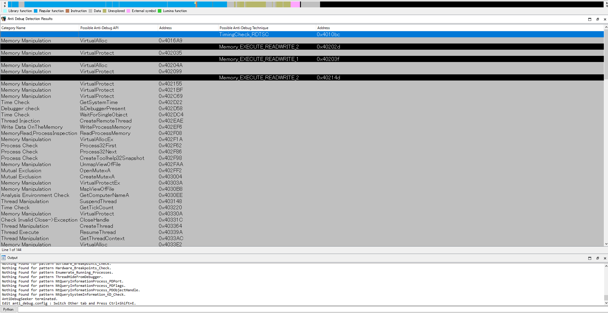
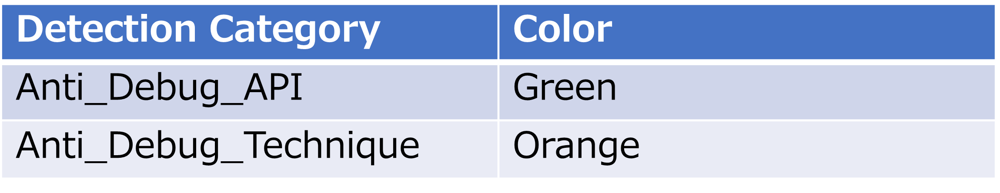

# IDA_Plugin_AntiDebugSeeker

## Concept

This tool was created to assist those who are new to malware analysis or are not yet familiar with anti-debugging techniques. 
Through this tool, users can automatically extract potential anti-debugging methods used by malware, making it easier for analysts to take appropriate action.

## Introduction

The main functionalities of this plugin are as follows:

- Extraction of APIs that are potentially being used for anti-debugging by the malware.
- In addition to APIs, extraction of anti-debugging techniques based on key phrases that serve as triggers, as some anti-debugging methods cannot be comprehensively identified by API calls alone.

For packed samples, running this plugin after unpacking and fixing the Import Address Table is more effective.

## Installation

Place the following three files under the plugin directory of IDA :

1. anti_debug.config (A file containing rules for detecting anti-debugging techniques)  
2. anti_debug_techniques_descriptions.json (A file containing descriptions of the detected rules)  
3. AntiDebugSeeker.py (The anti-debugging detection program)  

## Usage

**Ctrl + Shift + D (To launch the plugin)**    
A screen named “Anti Debug Detection Results” will appear after the analysis is complete.

Anti Debug Detection Results

- Category Name:  
API category name defined in the Anti_Debug_API as listed in anti_debug.config.  

- Possible Anti-Debug API:  
List of detected APIs displayed.  

- Address:  
Address where the detected API is being used.  

- Possible Anti-Debug Technique:  
Detection name identified by the keyword defined in Anti_Debug_Technique as listed in anti_debug.config.  

- Address:  
Address of the first detected keyword.  

(Address Transition)  
By double-clicking on the detected line, you will jump to the address specified.  

**Ctrl + Shift + E (Config File Editing)**  
Functionality for checking and editing the contents of anti_debug.config.  

After making changes,  
click the 'Save' button to save the modifications.  

## Support Functions

After running the plugin, detected APIs and keywords are highlighted in different colors.

Additionally, if an API specified in Anti_Debug_API is detected, the category name is added as a comment. Likewise, if a rule name is detected in Anti_Debug_Technique, a description of that rule is added as a comment to the first detected keyword.

## About anti_debug.config

## List of detectable anti-debugging techniques

